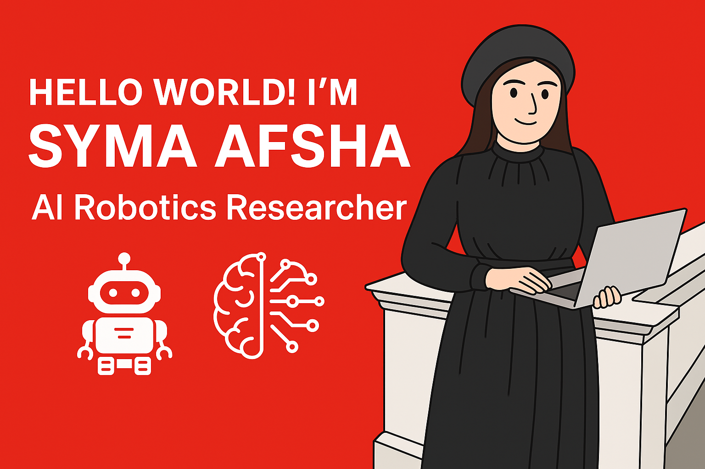

Welcome to my corner of GitHub! 🌟 
I’m passionate about building intelligent systems that learn, adapt, and evolve. From exploring deep reinforcement learning to integrating computer vision and robotic control, I work at the intersection of AI and robotics to create smart, autonomous machines.

##  A Bit About Me
### 🌱 I’m Currently Learning
- Reinforcement Learning.
### 🚀 I’m Looking to Collaborate On
- Deep Learning.
- Reinforcement Learning.
- Advanced Techniques in Path Planning.
### 📢 How to reach me: 
### 🎉 Fun facts about me
- I love making websites.
- I like to travel and take beautiful pictures.
### 📫 Connect with Me

 

### 🚀 Tech Stack & Tools

Here are the main technologies, libraries, and tools I work with:

---
#### 🔧 Programming Languages

  
  
  
  
  
  
  
  

---

#### 📚 Libraries

  
  
  
  
  
  
  

---

#### 🛠️ Software and Tools

  
  
  
  
  
  
  
  
  
  
  
  

---

#### 🌐 Web Development

  
  
  
  

---

#### 📱 App Development

  
  

---

#### 🗂️ Version Control

  

---

### 📊 Most Used Languages

  

## 📈 My GitHub Statistics

    

 

### 🌍 Visit My Personal Site

For more about my projects, achievements, and professional journey, take a tour of my digital portfolio here: [Syma Afsha](https://syma-afsha.github.io/syma-afsha/)

<picture>
 <source media="(prefers-color-scheme: dark)" srcset="https://github.com/syma-afsha/syma-afsha/blob/output/pacman-contribution-graph-dark.svg"/>

  
</picture>

  Thank you for stopping by! The intersection of robotics, AI, and real-world applications excites me every day. I’m always eager to connect with fellow innovators, researchers, and enthusiasts who share a passion for shaping the future of intelligent machines. If you’re excited by the mix of tech and creativity, let’s chat and see what amazing things we can build together 🤝.

